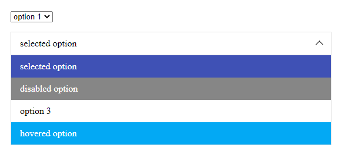

Do you wanna beautify your selects using pure javascript or typescript? Ok. This package was created for you.
I have written the most used methods in my opinion.



Demo page: https://denoro55.github.io/selectorizer/

**Works in IE 10+**

## implemented methods:

- getValues
- open
- close
- change
- addOptions
- setOptions
- refresh
- destroy

## options:

| Property             | Description                                                    | Type                   | Default value  |
|----------------------|----------------------------------------------------------------|------------------------|----------------|
| withIcon             | Set icon rendering                                             | boolean                | true           |
| iconHtml             | Set icon html                                                  | string                 |                |
| isNativeOnMobile     | Show native dropdown on mobiles. Updates on window resize      | boolean                | false          |
| isMobile             | Set pattern for detecting mobile screen                        | function               | function       |
| maxHeight            | Max height of dropdown                                         | number                 |                |
| classes              | Additional classes on selectorizer wrapper                     | string[]               | []             |
| placeholder          | Label value when no selected options                           | string                 | "Select value" |
| renderOption         | Set html of option                                             | function               |                |
| renderLabel          | Set label html of selectorizer                                 | function               |                |
| closeOnClickOutside  | Close selectorizer when click outside                          | boolean                | true           |
| calculateDropdownDir | Define dropdown position before open                           | boolean                | function       |
| multiple             | Set delimiter of multiple select                               | { delimiter: string }	 |                |
| callbacks            | Define callback functions that triggers after different events | object                 |                |


## callbacks:

- beforeInit?: (select: Selectorizer) => void;
- init?: (select: Selectorizer) => void;
- beforeOpen?: (select: Selectorizer) => void;
- open?: (select: Selectorizer) => void;
- beforeClose?: (select: Selectorizer) => void;
- close?: (select: Selectorizer) => void;
- beforeChange?: (select: Selectorizer) => void;
- change?: (select: Selectorizer) => void;
- beforeRefresh?: (select: Selectorizer) => void;
- refresh?: (select: Selectorizer) => void;
- click?: (select: Selectorizer) => void;
- beforeDestroy?: (select: Selectorizer) => void;
- destroy?: (select: Selectorizer) => void;

## How to use:

```ts
import "selectorizer/lib/styles/index.scss";
import { selectorize } from "selectorizer";

// node list
const selects = document.querySelectorAll("select");
selectorize(selects);

// single select
const singleSelect = document.querySelector("select");
if (singleSelect) {
  selectorize(singleSelect);
}

// Warning! If you want to reinit your selectorizer just specify second argument
const selects = document.querySelectorAll("select");

// first init
selectorize(selects);

// reinit
selectorize(selects, {
  withIcon: false,
});

// init with some options
const selects = document.querySelectorAll("select");
selectorize(selects, {
  withIcon: false,
  classes: ["my-class"],
  callbacks: {
    init: (selectorizer) => {
      const state = selectorizer.getState();
      const $elements = selectorizer.getElements();
      const $wrapper = selectorizer.getWrapper();
      const $select = selectorizer.getSelect();
      const config = selectorizer.getConfig();

      console.log(
        "init",
        selectorizer,
        state,
        $elements,
        $wrapper,
        $select,
        config
      );
    },
  },
  renderOption: (selectorizer, option) =>
    `<div class="my-awesome-option">${option.text}</div>`,
  renderLabel: (selectorizer) =>
    `<div class="my-awesome-label">${selectorizer.getCurrentValue()}</div>`,
  renderPlaceholder: (selectorizer) =>
    `<div class="my-awesome-placeholder">${selectorizer.getConfig().placeholder}</div>`,
});

// ok. let's start to do something with our selects

// *** get values of selects ***
selectorize(selects).getValues();
// [ { name: 'select-1', value: 'option 1' }, { name: 'select-2', value: 'option 1' } ]

// *** open selects ***
selectorize(selects).open();

// *** close selects ***
selectorize(selects).close();

// *** change value of selects ***
selectorize(selects).change("option 3");

// *** add new options ***
selectorize(selects).addOptions([
  { value: "new option 1", text: "new option 1" },
  { value: "new option 2", text: "new option 2" },
]);

// Warning! You can also update your native select without implemented methods, but then you must call refresh method
const $select = document.createElement("select");
const selectorizer = selectorize($select);

// append new option
const $option = document.createElement("option");
$option.value = "new value";
$option.text = "new value";
$select.appendChild(option);

// refresh selectorizer
selectorizer.refresh();

// *** set only specified options ***
selectorize(selects).setOptions([
  { value: "new option 1", text: "new option 1" },
  { value: "new option 2", text: "new option 2" },
]);

// *** destroy :( ***
selectorize(selects).destroy();
```